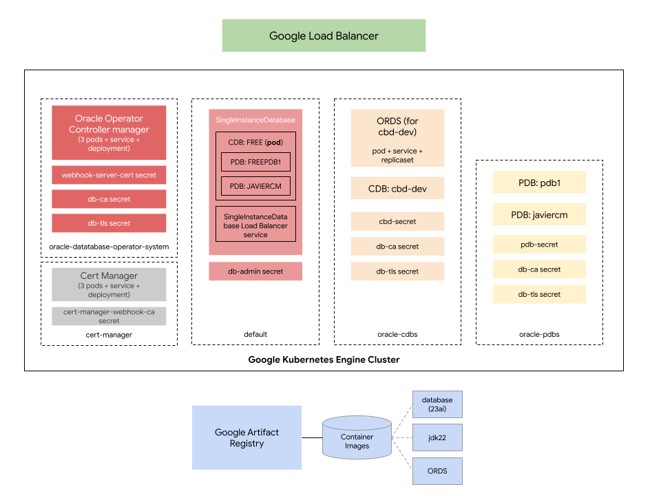

# Deploying the Oracle Operator on GKE

This repo has been created in collaboration with [Darren Evans (@dazdaz)](https://github.com/dazdaz).

## Why?

Because you can, it's _kind of_ fun, and it's a way to learn about other database options for GCP and Kubernetes.

**Disclaimer**: As of the time of writing, the Oracle Database Operator for Kubernetes [has not yet been tested by Oracle on GKE](https://github.com/oracle/oracle-database-operator?tab=readme-ov-file#release-status). However, as you'll see here, it works :-)

## Some concepts

This tutorial will be deploying the Oracle Database Operator for Kubernetes on GKE. This operator is designed to simplify the deployment and management of Oracle Database instances on Kubernetes. It will work with the concept of _Multitenant_ databases, which is a feature of Oracle Database that allows you to have multiple databases within a single Oracle Database instance. This is a feature that is available in Oracle Database 12c and later versions.

For multitenant databases, there are two key concepts to bear in mind that the Operator will be working with:

- The _Container Database_ (CDB): it contains one or many _Pluggable Databases_ (PDBs). The CDB is a main multitenancy enabled database instance, and it functions as the foundation, housing system metadata and shared resources essential for managing all the PDBs it contains.
- The _Pluggable Database_ (PDB): the PDBs are the individual databases that you can create within the CDB. It is essentially a portable collection of schemas, schema objects (like tables, views, etc.), and other database components, and acts like a self-contained database from an application's perspective, providing isolation and a dedicated environment.

So, the CDB acts as the foundation or container for the PDBs, where a single CDB can hold multiple PDBs, with each PDB functioning as a separate, pluggable unit within it.  The CDB provides centralized services and infrastructure that are shared by all the PDBs within it.

This is important in this context as the long term goal would be to have PDBs acting as separate databases for different applications, and the CDB providing the shared services and infrastructure for all the PDBs, all part of a Kubernetes Platform deployed on GKE.

The _Oracle Operator for Kubernetes_ allows you to connect to CDBs, that are no more than regular databases with multitenant capabilities. These databases can at the same time be created using the Oracle Operator inside Kubernetes, or they can be existing databases (inside or outside the Kubernetes world) that you want to manage using the Operator. The Operator also allows you to manage the lifecycle of PDBs inside the CDBs, like creating, deleting, or scaling them.

## This setup

In this tutorial you will be deploying a Single Instance Database through the Oracle Operator. What does this have to do with the CDB and PDBs? Well, **the Single Instance Database is a special case of a CDB with a single PDB**. This means that as soon as you've deployed it, you'll have a CDB with a single PDB, and you'll be able to connect to both the CDB and the PDB using standart Oracle Database tools like `sqlplus`, and also create more PDBs associated withe single CDB the database already has.

Once you've done that, you will proceed to creata a CDB kubernetes object to connect with the exiting CDB in the single instance database you've just deployed. That step will create in turn an Oracle service called ORDS (Oracle REST Data Services) that will allow you to connect to the CDB and PDBs using RESTful services. Each CDB will require an ORDS deployment that is connected to it, and will be used by the Oracle Operator to manage the lifecycle of the PDBs inside the CDB.

With ORDS in place and connected to the CDB inside the SingleInstanceDatabase, the last step will be to create a PDB kubernetes object through the Oracle Operator that will create a Pluggable Database (PDB) inside the Containerize Database (CDB) that the SingleInstanceDatabase has. This PDB object creation points to the CDB object created before, and will be using ORDS to connect to the database where the operations must be performed. The Kubernetes Oracle Operator talks RESTful services to the ORDS service, which at the same time uses a JDBC driver to talk to the actual database.

The diagram below depicts the logical relationship between the objects and services that will be created in this tutorial (color conventions, blue for the sidb, orange for the cdb, and yellow for the pdb are important to follow the relationships):

<div style="text-align: center;">
  
</div>

All required services and objects will use GCP infrastructure. More specifically, the Oracle Operator will be deployed on a GKE cluster, and the relevant container images will be built and stored in a Google Artifact Registry repository.

## Pre-requisites

Here are the things you'll need to have in place before you can run the steps to install the Oracle Operator on GKE:

- You'll need a GCP Project. Create it in your GCP environment.
- You'll need a Mac or a Linux computer. If a Mac, you'll need to install Homebrew. If you're using Windows, I'd recommend you to connect to a [Cloud Shell](https://cloud.google.com/shell/docs/launching-cloud-shell) from there.
- You'll need to install the Google Cloud SDK.  You can find the instructions [here](https://cloud.google.com/sdk/docs/install).
- You'll need to install kubectl.  You can find the instructions [here](https://kubernetes.io/docs/tasks/tools/install-kubectl/).

You'll also need to adjust the `env.bash` based on your specific configuration. The `PROJECT_ID` variable should be the one to change, and maybe the `REGION` and `ZONE_1` and `ZONE_2` ones. The rest can be left as they are, unless you have specific requirements to satisfy.

Finally, you need to set and export the DB_PASSWORD environment variable. This is the password for the Oracle Database. You can do this by running the following command:

```bash
export DB_PASSWORD=<your_password>
```

## Setting up the environment

The following diagram shows what the environment will look like after you've completed all the steps in this tutorial:

<div style="text-align: center;">
  
</div>

You may use it as a reference to understand the steps you'll be taking to set up the whole scenario.

You will use the [`oopgke.bash`](./oopgke.bash) script to automate all set up steps involved in getting the scenario depicted above ready. The script accepts a single argument, the name of a script's function.  Every configuration step in this tutorial has a corresponding function in the script. In that sense, the script is a quite detailed guide on how to set up this whole scenario. I'd recommend you to read the script to understand what's going on in each step after you've completed the tutorial or while you're making progress through the above steps.

### Step 1 - Creating the infrastructure

First, make sure you have performed the pre-requisites steps above. Then, run the script with the following option:

```bash
./oopgke.bash step1_create_infra
```

This will:

- Set up the GCP environment for you according to the variables you've set in the `env.sh` file.
- Enable the necessary APIs in your GCP project.
-Create the GKE cluster with one starting node in the configured region where you'll be deploying the Oracle Operator.
- Get the GKE credentials into your local kubeconfig file so you can interact with the cluster using `kubectl`:
- Create the necessary Artifact Registry repository to host the Oracle Database image you'll be building later on.

### Step 2 - Installing the Oracle Operator

Once [Step 1](#step-1---creating-the-infrastructure) has been completed, run the script with the following option:

```bash
./oopgke.bash step2_install_oracle_operator
```

<div style="text-align: center;">
  
</div>

This will:

- **Steps 1 and 2**: Install Certificates Manager in the GKE cluster.
- Install the `cmctl` tool in your local computer that will be used to check the proper installation of the Cert Manager.
- Check the Cert Manager installation using the previously installed `cmctl` tool.
- **Steps 3 and 4**: Deploy the Oracle Operator. This will use [the corresponding yaml](https://github.com/oracle/oracle-database-operator/blob/main/oracle-database-operator.yaml) file taken from the Oracle Database Operator GitHub repository
- Configure the necessary roles bindings in the GKE cluster to allow the Oracle Operator to run.

After the script has completed, it will prompt you to check for proper deployment of the Oracle Operator Controller Manager pods by running:

```bash
./oopgke.bash check_operator
```

Once the pods show up in a `Running` state, you can proceed to the next step.

### Step 3 - Deploying the Single Instance Database

Now that [Step 2](#step-2---installing-the-oracle-operator) has been completed, run the script with the following option:

```bash
./oopgke.bash step3_install_sidb
```

<div style="text-align: center;">
  
</div>

This will:

- Get the source files for the Oracle Database image building process.
- **Step 1**: Build a container image for the database version and flavor you want to base your PDBs and CDBs on. By default, the script will build an Oracle Database 23ai free version image, that supports the multitenant features required for this tutorial. Push that image into an Artifact Registry repository.
- **Step 2**: Deploy a Single Instance Database object using the Oracle Operator. This will create a `SingleInstanceDatabase` object in the Kubernetes cluster, and a `Secret` object that will store the password for the Oracle Database. The Single Instance Database already contains a CDB with a single PDB (**Step 3**)
- **Step 4**: Create a Kubernetes LoadBalancer service that will expose the Single Instance Database to the outside world. This will allow you to connect to the database using the Oracle Database tools like `sqlplus`.
- Check that the installation went well by querying the status of the `SingleInstanceDatabase` object.
- Install the `sqlplus` tool required to test connectivity agains the PDB and CDB databases.
- Use the `sqlplus` tool to connect to the Oracle Database and check that the connection is working.

What you see after the database creation and connection testing are the connection strings for the CDB and PDB databases present in the Single Instance Database you've just deployed. Oracle 23DBai is free and allows for multitenant features, but it's limited to a single CDB. The CDB is the main database that contains the PDBs, and in this case, there's only one PDB in the CDB. In the next steps, you'll be creating a CDB object that will connect to this CDB, and then a PDB object that will create a new PDB inside the CDB.

If something went wrong in this step, check the logs of the `oracle-database-operator-controller-manager` pod in the `oracle-database-operator-system` namespace to trouebleshoot any possible issues.

### Step 4 - Creating the CDB object (and installing ORDS)

[Step 3](#step-3---deploying-the-single-instance-database) got the database that you need in place. It's now time to request a CDB creation object that will claim the existing CDB, run the script with the following option:

```bash
./oopgke.bash step4_create_cdb_ords
```

<div style="text-align: center;">
  
</div>

This will:

- Download the source for building the ORDS image.
- **Step 1**: Build the Oracle JDK 22 image that will be used as base image for the ORDS image.Also, it will build the ORDS image that will be used to create an ORDS deployment once the CDB resource creation is requested to the Oracle Operator.
- **Step 2**: Prepare the existing CDB in the Single Instance Database so it can host `ORDS_PUBLIC_USER` schema required by ORDS. This involves creating an extensively authorized database user with the necessary permissions to edit and query Pluggable Databases using some SQL commands.
- **Step 3**: Create the Kubernetes namespaces `oracle-cdbs` and `oracle-pdbs` to host the ORDS deployment, the CDB objects, and the PDB objects.
- Create the certificates necessary for communication between the ORDS pod and the Oracle Operator. This secrets will be replicated across the namespaces created before.
- **Step 4**: Create the secrets required to store the ORDS database connection information, and the ones containing the certificates created before.
- **Step 5:**: Create the CDB Kubernetes object that will connect to the existing CDB in the Single Instance Database.

Now wait some seconds for the ORDS pod to be created and run `./oopgke.bash check_cdb`, This command gets the logs of the ORDS container, so you can see how ORDS is bootstraping and connecting to the CDB. After successful completion, you should see a log similar to the one below:

```text
2024-09-12T15:46:58.245Z INFO        Oracle REST Data Services initialized
Oracle REST Data Services version : 23.3.0.r2891830
Oracle REST Data Services server info: jetty/10.0.17
Oracle REST Data Services java info: Java HotSpot(TM) 64-Bit Server VM 22.0.2+9-70
```

Press `Ctrl+C` to stop the log output and carry on with the next step.

### Step 5 - Creating the PDB object

Now that the CDB object is in place and the ORDS service is running, you can create a PDB object that will create a new PDB inside the CDB. Run the script with the following option:

```bash
./oopgke.bash step5_create_pdb
```

This will:

- Create a Kubernetes secret that will store the password for the PDB that will be created.
- Create the PDB Kubernetes object that will create a new PDB inside the CDB.

After the PDB object is created, you can check the status of the PDB object by running:

```bash
./oopgke.bash check_pdb
```

This will show you the status of the PDB object, and you should see a log similar to the one below:

```text
Checking PDB...

==================================================================

CDB=cdb-dev
K8SNAME=javiercm
PDBNAME=JAVIERCM
OPENMODE=READ WRITE
ACTION=CREATE
MSG=Success
```

Finally, connect to the Single Instance Database and check that the new PDB has been created. You can do this by running the following command:

```bash
./oopgke.bash check_pdb_databases
```

You should see a log similar to the one below:

```text
SQL> 
    CON_ID CON_NAME                       OPEN MODE  RESTRICTED
---------- ------------------------------ ---------- ----------
         2 PDB$SEED                       READ ONLY  NO
         3 FREEPDB1                       READ WRITE NO
         4 JAVIERCM                       READ WRITE NO
```

## Rendering the yaml files

This is an optional step, best done before starting with this tutorial.If you prefer not to go through the tutorial and just inspect the Kubernetes manifests to be used in this tutorial, just run the following:

```bash
export DB_PASSWORD=<any-password-would-do>
./oopgke.bash render_dist_yamls
```

This will render the corresponding manifests for the SIDB, CDB and PDB into the `k8s/` folder.

## Cleanup

To do a cleanup of the resources created in this tutorial, you can run the following command:

```bash
./oopgke.bash full_cleanup
```

## Relevant links

- [Oracle Database Operator Usecase 03](https://github.com/oracle/oracle-database-operator/blob/main/docs/multitenant/usecase03/README.md)
- [Oracle Database - Fit for Kubernetes](https://blogs.oracle.com/coretec/post/oracle-database-fit-for-kubernetes)

## License

All solutions within this repository are provided under the Apache 2.0 license. Please see the LICENSE file for more detailed terms and conditions.

## Disclaimer

This repository and its contents are not an official Google product.
